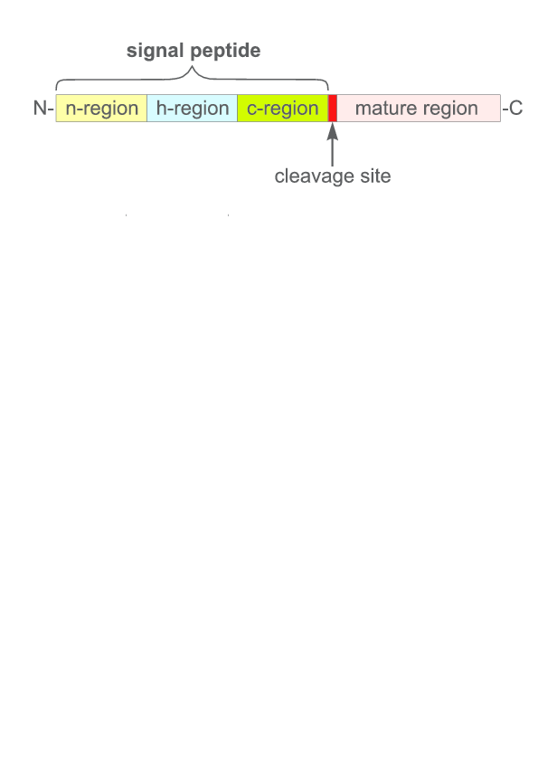

```{r, echo = FALSE, message = FALSE, results='asis',warning=FALSE}
library(DT)
library(knitr)
library(ggplot2)
library(grid)
library(gridExtra)
library(dplyr)
library(biogram)
library(reshape2)
library(plotly)
library(latex2exp)

options(DT.options = list(iDisplayLength = 6, searching = TRUE))

size_mod <- -1

enc2df <- function(x)
  data.frame(Name = names(x), Elements = toupper(sapply(x, paste0, collapse = ", ")))

my_theme <- theme(
  axis.text = element_text(size=13 + size_mod),
  axis.title.x = element_text(size=14 + size_mod, vjust = -1),
  axis.title.y = element_text(size=14 + size_mod, vjust = 1),
  
  legend.background = element_rect(fill = "NA"),
  legend.key = element_rect(fill = "NA", color = "NA", size = 0.5),
  legend.position = "right",
  #uncomment for publications
  legend.key.size = unit(0.1, "inches"),
  #legend.margin = unit(-0.25, "lines"),
  legend.text = element_text(size=13 + size_mod), 
  legend.title = element_text(size=15 + size_mod),
  
  panel.grid.major = element_line(color="grey", linetype = "dashed", size = 0.5),
  panel.grid.major = element_line(color="lightgrey", 
                                  linetype = "dashed", size = 0.5),
  panel.background = element_rect(fill = "transparent", color = "black"),
  
  plot.background=element_rect(fill = "transparent",
                               color = "transparent"),
  #uncomment for publications
  plot.margin = unit(rep(0.2, 4), "inches"),
  plot.title = element_text(size=20 + size_mod),
  
  strip.background = element_rect(fill = "NA", color = "NA"),
  strip.text = element_text(size=13 + size_mod, face = "bold")
)
```

## Outline

1. Amyloids and hot spots.  
2. n-gram analysis.  
3. Encoding of amino acids.  
4. Quick Permutation Test.  
4. Best-performing encoding.  
5. Benchmark.  

## Amyloids

Proteins associated with various neurodegenerative disorders (e.g., Alzheimer's, Parkinson'a's, Creutzfeldta-Jakob'a's diseases) creating harmful aggregates.

<!--  -->


Amyloid aggregates (red) around neurons (green). Strittmatter Laboratory, Yale University

## Hot spots

The aggregation of amyloids is initiated by 6- to 15-residue segments called hot spots, diverse subsequences that form unique  zipper-like $\beta$-structures.


@sawaya_atomic_2007

## Aim

Analize structure of hot spots and create a novel predictor of amyloids.

<!-- ## Programy przewidujące lokalizację hot spots -->

<!-- Zróżnicowanie budowy hot spots uniemożliwa opisanie ich konkretnych wzorcem.   -->

<!-- Istnieją już programy przewidujące miejsca inicjacji agregacji: -->

<!-- * APPNN [@familia_prediction_2015],  -->
<!-- * PASTA2 [@walsh_pasta_2014],  -->
<!-- * FoldAmyloid [@garbuzynskiy_foldamyloid:_2010]. -->

<!-- Precyzja tych programów nie jest wysoka, a wykorzystywane przez nie reguły decyzyjne są trudno interpretowalne. -->

<!-- ## Peptydy sygnałowe -->

<!-- Peptydy sygnałowe to krótkie (15-30 aminokwasów) N-końcowe sekwencje kierujące białko do sekrecji. -->

<!-- Powszechny model klasycznych peptydów sygnałowych zakłada, że rozpoczynają się one naładowanym dodatnio n-regionem, po którym występuje hydrofobowy h-region and c-region zakończony miejscem cięcia rozpoznawanym przez peptydazę sygnałową.  -->

<!-- ## Peptydy sygnałowe -->

<!--  -->

<!-- ## Peptydy sygnałowe -->

<!-- Analizy dużej liczby sekwencji reprezentujących szerokie spektrum zróżnicowanych taksonomicznie gatunków wskazują na dużą zmienność peptydów sygnałowych. -->

## n-grams

Sample sequences. S - sequence, P - position. 

```{r, echo = FALSE, message = FALSE, results='asis',warning=FALSE}
library(seqinr)
aa_v <- seqinr::a()[-1]
set.seed(1)
sample_seq <- matrix(sample(aa_v, 18, replace = TRUE), nrow = 3)
colnames(sample_seq) <- paste0("P", 1L:ncol(sample_seq))
rownames(sample_seq) <- paste0("S", 1L:nrow(sample_seq))
sample_seq_dat <- data.frame(sample_seq)

colors <- c('aquamarine', 'red', "orange")

datatable(sample_seq_dat, 
          rownames = TRUE, filter = "none", 
          options = list(dom = 't')) %>% 
  formatStyle(
    'P1',
    color = styleEqual(c("G", "I", "N"), colors)
  )


```

### 1-grams:

```{r, echo = FALSE,results='asis'}
decode_ngrams(seq2ngrams(sample_seq, 1, aa_v, d = 0)[1L:3]) %>% 
  gsub("_", "-", x = .) %>% 
  paste0(paste0('<font color="',  colors, '">'), .) %>% 
  paste0(., "</font>") %>% 
  paste0(collapse = ", ") %>% 
  paste0("### ", .) %>% 
  cat
```


## n-grams

Sample sequences. S - sequence, P - position. 

```{r, echo = FALSE, message = FALSE, results='asis',warning=FALSE}
datatable(sample_seq_dat, 
          rownames = TRUE, filter = "none", 
          options = list(dom = 't')) %>% 
  formatStyle(
    'P1',
    color = styleEqual(c("G", "I", "N"), colors)
  ) %>% 
  formatStyle(
    'P2',
    color = styleEqual(c("W", "F", "V"), colors)
  )

```

### 2-grams:

```{r, echo = FALSE,results='asis'}
decode_ngrams(seq2ngrams(sample_seq, 2, aa_v, d = 0)[1L:3]) %>% 
  gsub("_", "-", x = .) %>% 
  paste0(paste0('<font color="',  colors, '">'), .) %>% 
  paste0(., "</font>") %>% 
  paste0(collapse = ", ") %>% 
  paste0("### ", .) %>% 
  cat
```

## n-grams

Sample sequences. S - sequence, P - position. 

```{r, echo = FALSE, message = FALSE, results='asis',warning=FALSE}
datatable(sample_seq_dat, 
          rownames = TRUE, filter = "none", 
          options = list(dom = 't')) %>% 
  formatStyle(
    'P1',
    color = styleEqual(c("G", "I", "N"), colors)
  ) %>% 
  formatStyle(
    'P2',
    color = styleEqual(c("W", "F", "V"), colors)
  ) %>% 
  formatStyle(
    'P3',
    color = styleEqual(c("W", "Q", "P"), colors)
  )
```

### 3-grams:

```{r, echo = FALSE,results='asis'}
decode_ngrams(seq2ngrams(sample_seq, 3, aa_v, d = 0)[1L:3]) %>% 
  gsub("_", "-", x = .) %>% 
  paste0(paste0('<font color="',  colors, '">'), .) %>% 
  paste0(., "</font>") %>% 
  paste0(collapse = ", ") %>% 
  paste0("### ", .) %>% 
  cat
```


## n-grams

Sample sequences. S - sequence, P - position. 

```{r, echo = FALSE, message = FALSE, results='asis',warning=FALSE}
datatable(sample_seq_dat, 
          rownames = TRUE, filter = "none", 
          options = list(dom = 't')) %>% 
  formatStyle(
    'P1',
    color = styleEqual(c("G", "I", "N"), colors)
  ) %>% 
  formatStyle(
    'P3',
    color = styleEqual(c("W", "Q", "P"), colors)
  )
```

### 2-grams (gaps between elements 1):

```{r, echo = FALSE,results='asis'}
decode_ngrams(seq2ngrams(sample_seq, 2, aa_v, d = 1)[1L:3]) %>% 
  gsub("_", "-", x = .) %>% 
  paste0(paste0('<font color="',  colors, '">'), .) %>% 
  paste0(., "</font>") %>% 
  paste0(collapse = ", ") %>% 
  paste0("### ", .) %>% 
  cat
```

## n-grams

Sample sequences. S - sequence, P - position. 

```{r, echo = FALSE, message = FALSE, results='asis',warning=FALSE}
datatable(sample_seq_dat, 
          rownames = TRUE, filter = "none", 
          options = list(dom = 't')) %>% 
  formatStyle(
    'P1',
    color = styleEqual(c("G", "I", "N"), colors)
  ) %>% 
  formatStyle(
    'P4',
    color = styleEqual(c("C", "F", "E"), colors)
  )
```

### 2-grams (gaps between elements 2):

```{r, echo = FALSE,results='asis'}
decode_ngrams(seq2ngrams(sample_seq, 2, aa_v, d = 2)[1L:3]) %>% 
  gsub("_", "-", x = .) %>% 
  paste0(paste0('<font color="',  colors, '">'), .) %>% 
  paste0(., "</font>") %>% 
  paste0(collapse = ", ") %>% 
  paste0("### ", .) %>% 
  cat
```


## n-grams

Sample sequences. S - sequence, P - position. 

```{r, echo = FALSE, message = FALSE, results='asis',warning=FALSE}
datatable(sample_seq_dat, 
          rownames = TRUE, filter = "none", 
          options = list(dom = 't')) %>% 
  formatStyle(
    'P1',
    color = styleEqual(c("G", "I", "N"), colors)
  ) %>% 
  formatStyle(
    'P3',
    color = styleEqual(c("W", "Q", "P"), colors)
  ) %>% 
  formatStyle(
    'P5',
    color = styleEqual(c("Q", "I", "S"), colors)
  )
```

### 3-grams (gaps between elements 1):

```{r, echo = FALSE,results='asis'}
decode_ngrams(seq2ngrams(sample_seq, 3, aa_v, d = 1)[1L:3]) %>% 
  gsub("_", "-", x = .) %>% 
  paste0(paste0('<font color="',  colors, '">'), .) %>% 
  paste0(., "</font>") %>% 
  paste0(collapse = ", ") %>% 
  paste0("### ", .) %>% 
  cat
```


## n-grams

Sample sequences. S - sequence, P - position. 

```{r, echo = FALSE, message = FALSE, results='asis',warning=FALSE}
datatable(sample_seq_dat, 
          rownames = TRUE, filter = "none", 
          options = list(dom = 't')) %>% 
  formatStyle(
    'P1',
    color = styleEqual(c("G", "I", "N"), colors)
  ) %>% 
  formatStyle(
    'P2',
    color = styleEqual(c("W", "F", "V"), colors)
  ) %>% 
  formatStyle(
    'P4',
    color = styleEqual(c("C", "F", "E"), colors)
  )
```

### 3-grams (gaps between elements 0 and 1):

```{r, echo = FALSE,results='asis'}
decode_ngrams(seq2ngrams(sample_seq, 3, aa_v, d = c(0, 1))[1L:3]) %>% 
  gsub("_", "-", x = .) %>% 
  paste0(paste0('<font color="',  colors, '">'), .) %>% 
  paste0(., "</font>") %>% 
  paste0(collapse = ", ") %>% 
  paste0("### ", .) %>% 
  cat
```

## Quick Permutation Test

Informative n-grams are usually selected using permutation tests.

During a permutation test we shuffle randomly class labels and compute a defined statistic (e.g. information gain). Values of statistic for permuted data are compared with the value of statistic for original data.

$$      
\textrm{p-value} = \frac{N_{T_P > T_R}}{N}
$$

$N_{T_P > T_R}$: number of cases, where $T_P$ (permuted test statistic) has more extreme values than $T_R$ (test statistic for original data).  

$N$: number of permutations.  

## QuiPT

**Qui**ck **P**ermutation **T**est is a fast alternative to permutation tests for n-gram data. It also allows precise estimation of p-value.

QuiPT is avaible as part of the **biogram** R package. 

## Encoding of amino acids

Amino acid alphabets containing 10-12 letters can be used to design foldable sequences for a large number of protein families [@murphy_simplified_2000].

## Encoding of amino acids

```{r, echo = FALSE, message = FALSE, results='asis',warning=FALSE}
datatable(enc2df(list(`1` = "g", 
                      `2` = c("k", "p", "r"), 
                      `3` = c("i", "l", "v"), 
                      `4` = c("f", "w", "y"), 
                      `5` = c("a", "c", "h", "m"), 
                      `6` = c("d", "e", "n", "q", "s", "t"))), 
          rownames = FALSE, filter = "none", 
          options = list(dom = 't')) 
```

Example: GPRS -- 1226.

## Reduced dimensionality

```{r, echo = FALSE, message = FALSE, results='asis',warning=FALSE,fig.width=11}
L <- 5
m <- 20
m2 <- 6
n <- 1:5
n_max <- L*m^n
n_max2 <- L*m2^n
dat <- data.frame(n = c(n, n), n_max = c(n_max, n_max2), m = c(rep(m, 5), rep(m2, 5)))
dat[["m"]] <- factor(dat[["m"]])

ggplot(dat, aes(x = n, y = n_max, color = m, label = formatC(n_max, digits = 4))) +
  geom_text(x = 1, y = 6, color = "black", label = as.character(TeX("$n_{max} = L \\times m^n$")), parse = TRUE, size = 6) +
  geom_line(linetype="dotted", size=1.5) +
  geom_point(size=7, shape=16) +
  geom_text(size = 6, vjust = -1.5, hjust = -0.05) +
  coord_cartesian(ylim = c(1, 5e7), xlim = c(0.5, 5.7)) +
  scale_x_continuous("n (n-gram length)", breaks = 0L:5) +
  scale_y_continuous(TeX("$n_{max}$ (log10)"), trans = "log10") +
  scale_color_discrete("m (alphabet\nlength)") +
  my_theme
```


## Creation of encodings

We created 524 284 encodings with different levels of 
amino acid alphabet reduction, from three to six groups of amino acid which was performed 
on all combinations of the normalized values of 17 handpicked physicochemical properties from AAIndex database [@kawashima_aaindex:_2008].

## Selection of the best-performing encoding

We cross-validated 18,535 random forests classifiers [@wright_ranger:_2015] on unique amino acid encodings to identify the best-performing encoding.  

We trained several iterations of each classifier on amyloidogenic and non-amyloidogenic sequences with different length. 

## Selection of the best-performing encoding

```{r, echo = FALSE, message = FALSE, results='asis',warning=FALSE,fig.width=10}

amyloids_plot <- read.csv2("AUC_boxplot6.csv", row.names = NULL)
ggplot(amyloids_plot, aes(x = len_range, y = AUC_mean)) +
  geom_boxplot(outlier.color = "grey", outlier.shape = 1) +
  geom_point(data = filter(amyloids_plot, et != "Encoding"),
             aes(x = len_range, y = AUC_mean, color = et, shape = et), size = 4) +
  scale_x_discrete("") +
  scale_y_continuous("Mean AUC") +
  scale_shape_manual("", values = c(16, 1, 15, 15), drop = FALSE) +
  scale_color_manual("", values = c("red", "grey", "blue", "green"), drop = FALSE) +
  my_theme +
  coord_flip()
```


## Best-performing encoding

```{r, echo = FALSE, message = FALSE, results='asis',warning=FALSE}
datatable(enc2df(list(`1` = "g", 
                      `2` = c("k", "p", "r"), 
                      `3` = c("i", "l", "v"), 
                      `4` = c("f", "w", "y"), 
                      `5` = c("a", "c", "h", "m"), 
                      `6` = c("d", "e", "n", "q", "s", "t"))), 
          rownames = FALSE, filter = "none", 
          options = list(dom = 't')) 
```

## Best-performing encoding

```{r, echo = FALSE, message = FALSE, results='asis',warning=FALSE}
datatable(enc2df(list(`1` = "g", 
                      `2` = c("k", "p", "r"), 
                      `3` = c("i", "l", "v"), 
                      `4` = c("f", "w", "y"), 
                      `5` = c("a", "c", "h", "m"), 
                      `6` = c("d", "e", "n", "q", "s", "t"))), 
          rownames = FALSE, filter = "none", 
          options = list(dom = 't')) %>% 
  formatStyle(
    'Elements',
    backgroundColor = styleEqual("K, P, R", 'aquamarine')
  )
```

Amino acids K, P, R are known $\beta$-breakers and should not occur in amyloids. [@paz_sequence_2004]. 

## Best-performing encoding

```{r, echo = FALSE, message = FALSE, results='asis',warning=FALSE}
datatable(enc2df(list(`1` = "g", 
                      `2` = c("k", "p", "r"), 
                      `3` = c("i", "l", "v"), 
                      `4` = c("f", "w", "y"), 
                      `5` = c("a", "c", "h", "m"), 
                      `6` = c("d", "e", "n", "q", "s", "t"))), 
          rownames = FALSE, filter = "none", 
          options = list(dom = 't')) %>% 
  formatStyle(
    'Elements',
    backgroundColor = styleEqual(c("I, L, V", "F, W, Y"), c('aquamarine', 'aquamarine'))
  )
```

Hydrophobic amino acids are typical for amyloids [@doran_role_2012].

## Informative n-grams

During analysis we identified 65 most informative n-grams. Part of them was experimentally confirmed [@paz_sequence_2004].

## Informative n-grams

```{r, echo = FALSE, message = FALSE, results='asis',warning=FALSE,fig.width=11}
ngram_freq <- read.csv("ngram_freq.csv") %>% 
  mutate(amyloid = diff_freq > 0) %>%
  select(decoded_name, amyloid, association) %>% 
  filter(!duplicated(.))

ngram_freq_plot <- table(ngram_freq[["association"]], ngram_freq[["amyloid"]]) %>% 
  melt %>% 
  rename(association = Var1, pred = Var2) %>% 
  mutate(association = factor(association, labels = c("Amyloidogenic", "Non-amyloidogenic", "Not investigated")),
         pred = factor(pred, labels = rev(c("Amyloidogenic\n", "Non-amyloidogenic\n"))))
my_dodge <- position_dodge(1)

ggplot(ngram_freq_plot, aes(fill = pred, y = value, x = association, label = value)) +
  geom_bar(stat = "identity", position = my_dodge) +
  geom_text(size = 6, position = my_dodge, vjust = -0.5) +
  scale_x_discrete("Experimental data\n(pattern status)") +
  scale_y_continuous("Number of n-grams") +
  coord_cartesian(ylim = c(0, 30)) +
  scale_fill_manual("n-gram association", values = c("darkmagenta", "cadetblue")) +
  #guides(fill = FALSE) +
  #facet_wrap(~ pred) +
  my_theme 

```

## AmyloGram

We used best-performing alphabet, AmyloGram, to create a novel predictor of amyloidogenicity based on n-grams.

## AmyloGram - benchmark

```{r, echo = FALSE, message = FALSE, results='asis',warning=FALSE}
benchmark_dat <- structure(list(classifier = structure(c(4L, 3L, 1L, 2L), 
                                                       .Label = c("appnn", "class14592_10", "FoldAmyloid", "PASTA2"),
                                                       class = "factor"), 
                                AUC = c(0.854996271439225, 0.735098185433756, 
                                        0.834302759134974,  0.897153865274671), 
                                MCC = c(0.429123592940917, 0.45255292317694, 
                                        0.582260193831285, 0.630749412736651), 
                                pos = c(NA, NA, NA, 10L), 
                                nice_name = structure(c(4L, 3L, 2L, 1L), 
                                                      .Label = c("14592", "appnn", "FoldAmyloid", "PASTA2"), 
                                                      class = "factor")),
                           .Names = c("classifier", "AUC", "MCC", "pos", "nice_name"), 
                           row.names = c(1L, 2L, 3L, 5L), class = "data.frame")

benchmark_dat %>% 
  mutate(classifier = as.character(classifier)) %>% 
  mutate(classifier = ifelse(classifier == "class14592_10", "AmyloGram", classifier)) %>% 
  rename(Software = classifier) %>% 
  select(1L:3) %>% 
  datatable(rownames = FALSE, filter = "none", 
            options = list(dom = 't')) %>% 
  formatRound(2L:3, 4) %>% 
  formatStyle(
    'AUC',
    backgroundColor = styleInterval(c(0.897, 1), c('white', 'aquamarine', 'white'))
  ) %>%
  formatStyle(
    'MCC',
    backgroundColor = styleInterval(c(0.63, 1), c('white', 'aquamarine', 'white'))
  )

```


## Summary and perspectives

* Cross-validate n-gram model.
* Define optimal length of the alphabet.
* Experimentally verify n-gram motifs.


## Acknowledgements

* Piotr Sobczyk.
* Paweł Mackiewicz.
* Małgorzata Kotulska.

Computations were carried out in Wroclaw Center for Networking 
and Supercomputing (http://www.wcss.pl) and funded by the
institutional grant No. 347. This research was partially funded by the KNOW Consortium and
National Science Center (2015/17/N/NZ2/01845).


## References
